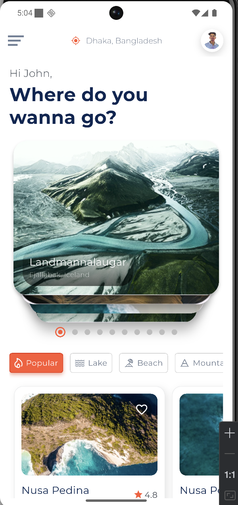
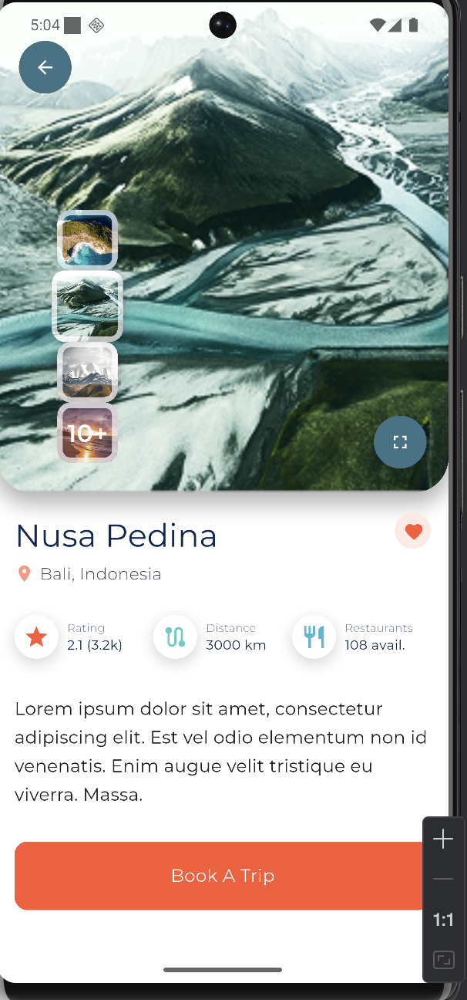
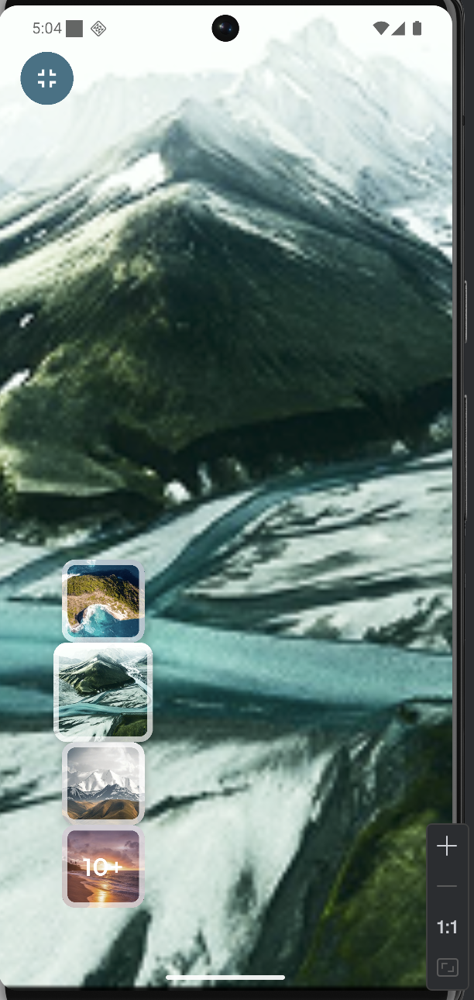
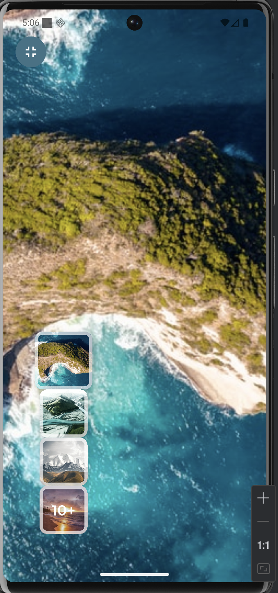

# Travel App UI (Flutter)

A modern travel app UI built with Flutter based on the provided Figma design.  
This project focuses on beautiful UI, smooth animations, and a clean architecture.

## 🚀 Features
- Home Screen with:
  - Greeting text & location
  - Card carousel (swipeable destinations)
  - Category chips (Popular, Lake, Beach, Mountain)
  - Horizontal list of popular destinations
- Detail Screen with:
  - Large hero image
  - Image previews on side
  - Location, rating, distance, restaurants info
  - Description text
  - "Book A Trip" CTA button

## App Screenshot

Here are the screenshots of the app:

